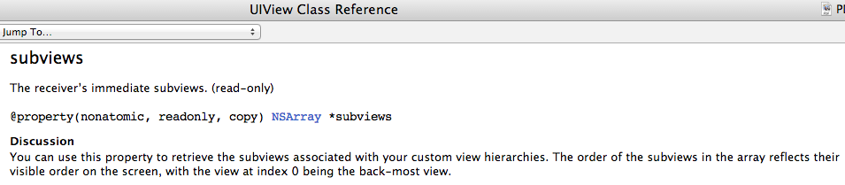
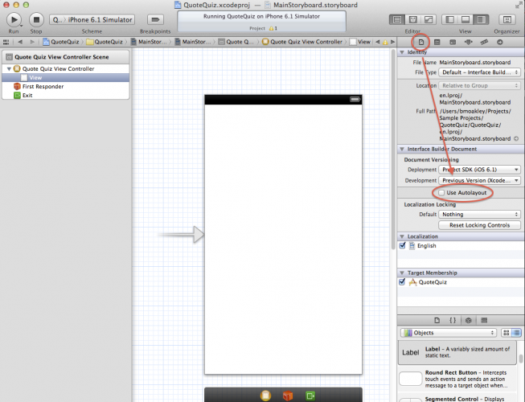

#Ejercicios de autoevaluación#
##ENUNCIADOS. Week 1. Objective-C.       
RESPUESTAS


** 1.  En la sentencia siguiente:**

```
[NSString alloc];
```

**¿se invoca método de instancia o de clase? **


Se invoca un metodo de clase. Notar que los métodos de clase tienen la siguiente sintaxis:
  [ ClassName message ];
donde ClassName es el nombre de la clase, en nuestro caso NSString.

***

** 2. En la siguiente sentencia:**
```
  NSString  * name =  [[NSString alloc] init ];
```
**¿Se invocan métodos de instancia o de clase?**

Se invoca un método de clase y a continuacion un método de instancia. En la primera linea se invoca:

       [NSString alloc] ;
que devuelve un objeto de tipo id. A este objeto se le manda el metodo de instancia init, la primera linea es equivalente a:

        id i = [NSString alloc];
    NSString *nombre = [i init];

Notar que los metodos de clase tienen la siguiente sintaxis:

    [ ClassName message ];

donde ClassName es el nombre de la clase, en nuestro caso NSString.

En la segunda linea se llama a un método de instancia. Los métodoss de instancia tienen la sintaxis siguiente:
```
   [object message ];
```
donde object es una variable que apunta a un objeto al que mandamos un mensaje.

***
** 3. ¿Como escribirías la sentencia siguiente: **
```
[[NSStringList  alloc] init] ;
```
** en dos lineas? **

     id i = [NSString alloc];
    NSString *nombre = [i init];

***
** 4. ¿Que significa el tipo id? **

id is a special keyword used in Objective-C to mean “some kind of object.” It does not contain isa pointer (isa, gives the object access to its class and, through the class, to all the classes it inherits from), So you lose compile-time information about the object.
Example:
```
NSString* aString = @"Hello";
 id anObj = aString;
```

***

**5.  ¿Se puede usar self en un método de clase?**

Si. Dentro de un método de clase, _self_ indica el objeto que representa la clase correspondiente.:
Por ejemplo:

```
+ (id)create {
  return [[self alloc] init];
}
```
is the same as:

 ```
+ (id)create {
  return [[SomeClass alloc] init];
}
```


***
** 6.  ¿Que es un protocol?**
En un protocolo, se declaran métodos y propiedades que son independientes de una clase especifica.
https://developer.apple.com/library/ios/documentation/Cocoa/Conceptual/ProgrammingWithObjectiveC/WorkingwithProtocols/WorkingwithProtocols.html

***

** 7.  ¿Con que sintaxis indico que una clase implementa los métodos de un protocolo?**

Para indicar que MyClass conforma el protocolo myProtocol escribiremos:


```
@interface MyClass : NSObject <MyProtocol>
…
@end
```
***
** 8.  ¿Como puedo acceder a la documentación de una clase desde XCode?**

 (Situar el cursor sobre la clase y presionar ⌥+ click)


***


** 9. ¿Como puedo destacar la signatura de un método?**


Situamos el cursor sobre el método presionando a la vez la tecla ⌘


***


** 10. NSUInteger ¿es una clase de Objective-C o un tipo primitivo de C? ¿Como puedo saberlo?**

Es una estructura de C, Acceder a la documentación observar que menciona que NSUInteger es un typedef

***
** 11.  NSString ¿es una clase de Objective-C o un tipo primitivo de C? ¿Como puedo saberlo?**


NSString un objeto de Objective-C, Acceder a la documentación observar que dice object.
***

  **12.¿Que es un delegate? ¿Como indicamos que utilizamos una clase como delegate?**


A delegate is an object that acts on behalf of, or in coordination with, another object when that object encounters an event in a program. The delegating object is often a responder object—that is, an object inheriting from NSResponder in AppKit or UIResponder in UIKit—that is responding to a user event. The delegate is an object that is delegated control of the user interface for that event, or is at least asked to interpret the event in an application-specific manner.

https://developer.apple.com/library/ios/documentation/general/conceptual/CocoaEncyclopedia/DelegatesandDataSources/DelegatesandDataSources.html

***

  **13. Para las siguientes variables:**

     int i = 1;
      NSUInteger count = 2;
    NSNumber number = @1;

**   Escribe código para averiguar en que dirección de memoria se almacenan estas variables.**

```
NSLog(@"value:%p", &i);
NSLog(@"count:%p", &count);
NSLog(@"myString:%p", myString);
NSLog(@"myArr:%p", &number);
```


Obtenemos:
                                                                     value:   0xbfffc968
                                                                      count:  0xbfffc964
  					      myString:  0x7e14
                                                                       myArr:  0xbfffc95c

Los resultados variarán en diferentes ordenadores.


***
** 14. ¿Que significa la palabra clave static en una variable local?**

When you use the static modifier on a local variable, the function “remembers” its value across invocations.
Ejemplo:

```
// main.m
#import <Foundation/Foundation.h>
int countByTwo() {
 static int currentCount = 0;
currentCount += 2; return currentCount;
}
 int main(int argc, const char * argv[]) {
 @autoreleasepool {
   NSLog(@"%d", countByTwo()); // 2
   NSLog(@"%d", countByTwo()); // 4
   NSLog(@"%d", countByTwo()); // 6
    return 0;
    ]
 }

```

***
** 15. En iOS 7 ¿que se usa por defecto Gestion Manual de Memoria o ARC (Automatic Reference Counting)? ¿Como puedo decirle a XCode que no utilize ARC?**

Por defecto XCode 5 utiliza ARC. Para pasar a gestión manual de memoria:

In Xcode 5.0.2, select your project in Navigatior, select Build Settings, search for Apple LLVM 5.0 - Language - Objective C and change Objective-C Automatic Refence Counting to NO


Tambien desde Interface Builder si seleccionamos Main.storyboard podemos activar o desactivar Autolayout con un checkbox:


***

** 16. Despues de aprender Manual Memory Management ¿como interpretas la siguiente figura?**


Answer:  From left to right,
First, an instance of Class A creates a new object - it has a retain count of one. In code:
```
@interface A {
     - instanceMethod {
     X x = [[ X alloc] init ]; // after creation object X has a retain count of 1
    }
}
```
An instance of Class B retains the new object - it now has a retain count of 2.
An instance of class C makes a copy of the new object - this is another new object, with a retain count of one.
The instance of Class A releases the new object - it now has a retain count of 1, so is not deallocated.
Class C releases its copy - the copied instance is deallocated
Class B releases its reference to the new object. The reference count returns to zero and it is deallocated.

***
** 17. ¿Cual es el resultado de la siguiente sentencia?**

```
[nil isEqual: nil];      // returns NO!
```

En Objective-C se puede enviar cualquier mensaje a nil, y siempre devolverá 0 (o sea NO), incluso en los casos como el anterior en que no tiene sentido.

***

** 18. ¿Cual es el resultado del siguiente código**
```
BOOL result = [[NSMutableArray array] isMemberOfClass:[NSArray class]];
NSLog (@"%@", result? @"Yes!" : @"No!");   // returns No!
```

El método isMemberOfClass: sólo devolverá TRUE si la instancia es exactamente de la clase [NSArray class]. Pero en este caso la instancia es de la clase NSMutableArray, diferente de NSArray por tanto devuelve NO.
***

** 19. ¿Cual es el resultado del siguiente código? **
```
BOOL result = [[NSMutableArray array] isKindOfClass:[NSArray class]];
NSLog (@"%@", result? @"Yes!" : @"No!");   // returns YES!
```

El método isKindOfClass: sólo devolverá TRUE si la instancia es exactamente de la clase [NSArray class] o una subclase. En este caso la instancia es de la clase NSMutableArray, subclase de  NSArray por tanto devuelve YES.

***
##Ejercicios de autoevaluación.  Week 2  ( View )
## ENUNCIADOS


** 1.  Para representar una cadena de texto tenemos las clases NSString y su versión mutable NSMutableString. En el siguiente ejemplo modificamos el valor de una variable de tipo NSString ¿Cómo es posible?¿Acaso NSString no es inmutable?**

```
#import <Foundation/Foundation.h>
 @interface Person : NSObject
@property (nonatomic,strong)
NSString *name; // strong should be copy
@end
@implementation Person
@end
 int main(int argc, char *argv[]) {
   @autoreleasepool {
      Person *p = [Person new];
      NSMutableString *name = [[NSMutableString alloc] initWithString:@"Alice"];
      p.name = name;
      NSLog(@"%@",p.name); // prints Alice
      [name stringByAppendString:@"xxx"];
      NSLog(@"%@",p.name); // prints Alicexxx }
}
```


Respuesta. NSString es inmutable. Es decir el contenido al que apunta el puntero (@“Alice” en nuestro caso) no puede cambiar.


Sin embargo si podemos hacer que el puntero apunte a otra dirección con lo que el contenido al que apunta puede variar.


***
** 2. Siguiendo el ejemplo anterior, ¿como podemos definir la property para que no se modifique el valor?**


```
#import <Foundation/Foundation.h>
 @interface Person : NSObject
@property (nonatomic,copy) NSString *name; // strong should be copy
@end
@implementation Person
@end
 int main(int argc, char *argv[]) {
   @autoreleasepool {
      Person *p = [Person new];
      NSMutableString *name = [[NSMutableString alloc] initWithString:@"Alice"];
      p.name = name;
      NSLog(@"%@",p.name); // prints Alice
      [name stringByAppendString:@"xxx"];
      NSLog(@"%@",p.name); // prints Alice }
}

```


Notar que ahora cuando ejecutamos la sentencia
p.name = name;

se ejecuta el método set con copy:
```
-(NSString *) setName: (NSString * string) {
        return string.copy
}
```
***


** 3. ¿Como definirías el patrón target-action?**

Target action es un patrón de diseño en el que un objeto contiene la información necesaria para mandar un mensaje a otro objeto cuando ocurre un evento. La información almacenada consta de:
un action selector, que identifica el método que será invocado, y
un target que es el objeto que recibirá el mensaje.
Normalmente el target es un controller(por ejemplo un UIButon)  que reacciona al recibir el action message.


https://developer.apple.com/library/ios/documentation/general/conceptual/Devpedia-CocoaApp/TargetAction.html

***
** 4. ¿Puedes poner un ejemplo de código que ejemplifica el pattern target-action?**


En este ejercicio, creamos un UIButton y le asignamos un método que se ejecutará al pulsarlo.

```
{
    UIButton *button = [UIButton buttonWithType:UIButtonTypeSystem];
    button.frame = CGRectMake(10, 10, 100, 50);
    [self.view addSubview:button];

//   1.Set button's title for normal and highlighted state
    [button setTitle:@"Normal" forState:UIControlStateNormal];
    [button setTitle:@"Highlighted" forState:UIControlStateHighlighted];

//   2.When you press it, it should log "You pressed me!" or something similar
    [button addTarget:self
               action:@selector(buttonPressed)
     forControlEvents:UIControlEventTouchDown];
}
- (void)buttonPressed
{
    NSLog(@"button pressed");
}
```


***

** 5.  ¿Como definirías el patrón MVC? **

Consiste en separar las clases de nuestra aplicación en base a las responsabilidades que asumirán. Así:
 En Model tenemos los datos y la interacción básica con los datos
 En View tenemos la presentación de los datos al usuario
 En Controller tenemos la interacción con el usuario y la mediacion modelo-vista
***

** 6.  ¿En Interface Builder como puedo averiguar la distancia en pixeles de un elemento a la vista que le contiene? **

Seleccionamos un elemento y mantenemos pulsada la tecla ⌥ (option key), Interface Builder nos mostrará las 4 distancias al borde superior, inferior, derecho e izquierdo.

***


 ** 7. Si estamos en una clase ViewController, ¿como añadimos una vista a la vista principal?**

   Añadiremos la vista invocando  el método addSubView a la vista asociada del ViewController (self.view). Por ejemplo:
```
self.switchLabel = [[UILabel alloc] initWithFrame:CGRectMake(200, 200, 100, 50)];
    self.switchLabel.text = @"Hola caracola";
    [self.view addSubview:self.switchLabel];
```
***

** 8. Explica la diferencia entre frame y bounds de una vista.**

frame nos dice donde está la vista respecto a la supervista.
bounds nos dice donde se permite a la vista pintar (respecto a ella misma)
Por ejemplo en la siguiente sentencia:
```
[[UIimageView alloc] initWithFrame:CGRectMake(40, 40, 240, 380)];
```
posicionamos un UIView en las coordenadas 40,40 respecto a la supervista:


En cambio la propiedad bounds vale CGRect(0,0,240,380).
***
** 9. En UIVIew ¿que diferencia hay entre los métodos de inicialización initWithFrame: y initWithCoder: ?**

Utilizaremos initWithFrame: al crear una vista por código.
Utilizaremos initWithCoder: cuando queramos cargar un fichero NIB creado en Interface Builder

***

** 10. ¿Como accedemos a las vistas hijas de un UIView?**

Mediante la property subviews que contiene un NSArray con todas las subvistas:



** 11. En el siguiente ejemplo tenemos una clase Employee con **
**una propiedad age que contiene la edad del empleado. Podemos acceder a la edad:**
```
NSString age = employee.age;
```
** o modificarla: **
```
employee.age = @”20”;
```
***
** ¿Como podriamos acceder a la edad mediante KVC?**

Mediante KVC podemos acceder a la edad mediante:
```
[employee valueForKey:@"age"];
```

***

** 12. ¿Como podemos, mediante KVO, hacer que que el objeto inspector reciba notificaciones de cambio para la propiedad openingBalance y especificar que tanto el antiguo como el nuevo valor sean proporcionados en el método observer?**

```
[account addObserver: inpector
	forKeyPath: @”openingBlance”
	options: (NSKeyValueObservingOptionNew |
			NSKEyValueObservingOptionOld)
	context: NULL ];
```
***
** 13. ¿Se puede incorporar un elemento Popover o un SplitViewController en un iPhone?**

No. Tanto el Popover como el SplitViewController solo se pueden incorporar en un iPad, no a un iPhone.
***

** 14. ¿Como harias para instanciar y presentar un Popover en un iPad?**

```
MyViewController* content = [[MyViewController alloc] init];
UIPopoverController* aPopover = [[UIPopoverController alloc]
initWithContentViewController:content];
aPopover.delegate = self; !
self.popoverController = aPopover;!
[self.popoverController presentPopoverFromBarButtonItem:sender permittedArrowDirections:UIPopoverArrowDirectionAny animated:YES];
```
***

** 15. ¿Como crearias una ActionSheet por código?**


Un ActionSheet es un elemento gráfico que presenta al usuario una serie de alternativas para ejecutar una tarea. Para crearlo, en el método viewDidLoad del controlador escribiremos:
```
- (void)viewDidLoad {
  [super viewDidLoad];

  UIActionSheet *actionSheet = [[UIActionSheet alloc]
          initWithTitle:@"Delegate Example"
          delegate:self // telling this class to implement UIActionSheetDelegate
          cancelButtonTitle:@"Cancel"
          destructiveButtonTitle:@"Destructive Button"
          otherButtonTitles:@"Other Button",nil

  [actionSheet showInView:self.view];

  [actionSheet release];
}
```
Simplemente le decimos al controlador que va a tener que implementar el protocolo UIActionSheet para que pueda manejar los clicks.
Deberemos implementar este método para poder manejar los clicks sobre el ActionSheet:

```
- (void)actionSheet:(UIActionSheet *)actionSheet clickedButtonAtIndex:(NSInteger)buttonIndex {
  NSLog(@"hello world!");
}
```
Finalmente le tenemos que decir a nuestra clase que debe implementar el protocolo UIActionSheetDelegate para que pueda saber que funciones implementa este protocolo, para ello vamos al .h y añadimos:
```
@interface DelegateExampleViewController : UIViewController <UIActionSheetDelegate>
{

}
```
***
** 16. ¿Como crear un fichero xib e incorporarlo en nuestro proyecto?**


Si estamos creando un nuevo ViewController, seleccionamos el checkbox Also create XIB file. De esta forma se creará el fichero CustomView.xib y quedará incorporado a nuesto proyecto.
***
** 17. Siguiendo el ejemplo anterior ¿cómo cargariamos el XIB en la aplicación?**

Lo haríamos mediante el siguiente código:


```
CustomView* customView = [NSBundle mainBundle] loadNibNamed:@"CustomView" owner:nil options:nil] lastObject];
[self.view addSubview:customView];

```
***

** 18. Dado el Array siguiente:**
```

        NSArray *cars = @[@"Mercedes-Benz", @"BMW", @"Porsche",
                         @"Opel", @"Volkswagen", @"Audi"]
```
**¿como podemos acceder al último elemento?**

```
cars.lastObject;  // returns @”Audi”
```
***
** 19. En el ejemplo anterior ¿cual es la mejor forma de acceder al primer elemento del Array?**

```
cars.firstObject;  // returns @”Mercedes-Benz”
```
***
** 20. Los nuevos proyectos XCode tienen AutoLayout seleccionado por defecto. ¿Donde queda reflejado en Interface Builder?**


***


First Version: 14-10-2014  @Joan Barrull 2014      
Reviewed: 
Reviewed: 


