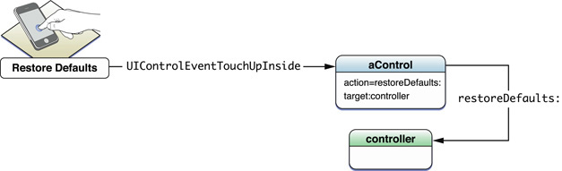

***
## Self Learning Exercises.  Week 2  ( View )
## 


** 1.  To modelize a text string we have NSString classes and their mutable version NSMutableString. In the following example we modify the value of a NSString variable. How is it possible? Is is it not NSString immutable?**

```
#import <Foundation/Foundation.h>
 @interface Person : NSObject
@property (nonatomic,strong)
NSString *name; // strong should be copy
@end
@implementation Person
@end
 int main(int argc, char *argv[]) {
   @autoreleasepool {
      Person *p = [Person new];
      NSMutableString *name = [[NSMutableString alloc] initWithString:@"Alice"];
      p.name = name;
      NSLog(@"%@",p.name); // prints Alice
      [name stringByAppendString:@"xxx"];
      NSLog(@"%@",p.name); // prints Alicexxx }
}
```


Answer. NSString is  immutable. That is, the content pointed by the pointer (@"Alice" in our case) can not change.


But it is possible force the pointer in order to point another address, so the content pointed can be different. @"Alice" continues to be immutable, but now is no more referenced by anyone.


***
** 2. Following the prior example, how can we define the property in order to not modify the value?**


```
#import <Foundation/Foundation.h>
 @interface Person : NSObject
@property (nonatomic,copy) NSString *name; // strong should be copy
@end
@implementation Person
@end
 int main(int argc, char *argv[]) {
   @autoreleasepool {
      Person *p = [Person new];
      NSMutableString *name = [[NSMutableString alloc] initWithString:@"Alice"];
      p.name = name;
      NSLog(@"%@",p.name); // prints Alice
      [name stringByAppendString:@"xxx"];
      NSLog(@"%@",p.name); // prints Alice }
}

```


Do note that when we execute the sentence:
p.name = name;

we execute the method set with copy:

```
-(NSString *) setName: (NSString * string) {
        return string.copy
}
```
***


** 3. Could you explain the target-action pattern?**

Cocoa uses the target-action mechanism for communication between a control and another object. This mechanism allows the control and, in OS X its cell or cells, to encapsulate the information necessary to send an application-specific instruction to the appropriate object. The receiving object—typically an instance of a custom class—is called the target. The action is the message that the control sends to the target. The object that is interested in the user event—the target—is the one that imparts significance to it, and this significance is usually reflected in the name it gives to the action.



https://developer.apple.com/library/ios/documentation/general/conceptual/Devpedia-CocoaApp/TargetAction.html

***
** 4. Could you present an code example of the pattern target-action?**


Here we create an UIButton, and then we set a method that will be invoked when we touch it.

```
{
    UIButton *button = [UIButton buttonWithType:UIButtonTypeSystem];
    button.frame = CGRectMake(10, 10, 100, 50);
    [self.view addSubview:button];

//   1.Set button's title for normal and highlighted state
    [button setTitle:@"Normal" forState:UIControlStateNormal];
    [button setTitle:@"Highlighted" forState:UIControlStateHighlighted];

//   2.When you press it, it should log "You pressed me!" or something similar
    [button addTarget:self
               action:@selector(buttonPressed)
     forControlEvents:UIControlEventTouchDown];
}
- (void)buttonPressed
{
    NSLog(@"button pressed");
}
```


***

** 5.  How would you define the MVC Pattern? **

The model-view-controller pattern proposes three main components or objects to be used:

- A Model , which represents the underlying, logical structure of data in a software application and the high-level class associated with it. This object model does not contain any information about the user interface.
- A View , which is a collection of classes representing the elements in the user interface (all of the things the user can see and respond to on the screen, such as buttons, display boxes, and so forth)
- A Controller , which represents the classes connecting the model and the view, and is used to communicate between classes in the model and view.


***

** 6.  In InterfaceBuilder how can I find out the distance in points from an element to their superview? **

We select theelement and press key  ⌥ (option key), Interface Builder will show us 4 distances to top, bottom, left an right.

***


 ** 7. How can we add a view to the main view?**

   We add a view invoking addSubView method Añadiremos la vista invocando  el método addSubView to the view of the ViewController (self.view). For instance:
```
self.switchLabel = [[UILabel alloc] initWithFrame:CGRectMake(200, 200, 100, 50)];
    self.switchLabel.text = @"Hola caracola";
    [self.view addSubview:self.switchLabel];
```
***

** 8. Could you explain the difference betweem frame and bounds of a view?**


frame represents where is the view from the superview.
bounds represents where in the view we can paint (from the view itself) 
For instance, in the follwoing sentence:
```
[[UIimageView alloc] initWithFrame:CGRectMake(40, 40, 240, 380)];
```
we make an UIView on the coordinates 40,40 (referenced from the superview:


Instead, the bounds property of the view is: CGRect(0,0,240,380).
***
** 9. For UIView what is the difference between initilization methods initWithFrame: and initWithCoder: ?**


We will use initWithFrame: when creating a view from code.
We will use initWithCoder: when we want to load a NIB file created through Interface Builder.

***

** 10. How to access the subviews property of a UIView?**


Through the property subviews that contains an NSArray with all subviews.


** 11. In the following example we have an Employee class with a property age that contains the employee age. We can get the age this way: **


```
NSString age = employee.age;
```
** or modify it: **
```
employee.age = @”20”;
```
***
**  How can we access tot the age  property through KVC?**

Through KVC we can access to the age with:
```
[employee valueForKey:@"age"];
```

***

** 12. How can we, through KVO, make sure the inspector get notifications of change for the property openingBalance and specify that the old and new value being get by the observer method**

```
[account addObserver: inpector
	forKeyPath: @”openingBlance”
	options: (NSKeyValueObservingOptionNew |
			NSKEyValueObservingOptionOld)
	context: NULL ];
```
***
** 13. Can I put an element Popover or an SplitViewController on an iPhone**

Only in iOS8. In prior iOs versions Popover and SplitViewController only can be used on an iPad, not an iPhone.
***

** 14. How can I instantiate and present a popover on an iPad?.**

```
MyViewController* content = [[MyViewController alloc] init];
UIPopoverController* aPopover = [[UIPopoverController alloc]
initWithContentViewController:content];
aPopover.delegate = self; !
self.popoverController = aPopover;!
[self.popoverController presentPopoverFromBarButtonItem:sender permittedArrowDirections:UIPopoverArrowDirectionAny animated:YES];
```
***

** 15. How can you create a n ActionSheet by code?**


An ActionSheet is a graphic element that presents to the user a list of choices to execute a job. In order to create we will write in the viewDidLoad method:
```
- (void)viewDidLoad {
  [super viewDidLoad];

  UIActionSheet *actionSheet = [[UIActionSheet alloc]
          initWithTitle:@"Delegate Example"
          delegate:self // telling this class to implement UIActionSheetDelegate
          cancelButtonTitle:@"Cancel"
          destructiveButtonTitle:@"Destructive Button"
          otherButtonTitles:@"Other Button",nil

  [actionSheet showInView:self.view];

  [actionSheet release];
}
```

We simply ask the controller to implement the protocol UIActionSheet in order to deal with user clicks.
We will implement this method:

```
- (void)actionSheet:(UIActionSheet *)actionSheet clickedButtonAtIndex:(NSInteger)buttonIndex {
  NSLog(@"hello world!");
}
```
Finally, our class need to impelement the protocol UIActionSheetDelegate ,so we go to the  .h and add:
```
@interface DelegateExampleViewController : UIViewController <UIActionSheetDelegate>
{

}
```
***
** 16. How to create a xib file in our project?**


If we are creating a new  ViewController, we select the checkbox _Also create XIB file_. This way we will create the file _CustomView.xib_.

***
** 17. Following the prior example ¿how to load the XIB file in our application?**

This cn be do with the following code:


```
CustomView* customView = [NSBundle mainBundle] loadNibNamed:@"CustomView" owner:nil options:nil] lastObject];
[self.view addSubview:customView];

```
***

** 18. If we have the follwing  Array:**

```
        NSArray *cars = @[@"Mercedes-Benz", @"BMW", @"Porsche",
                         @"Opel", @"Volkswagen", @"Audi"]
```
**how can access the last elementof the array?**

```
cars.lastObject;  // returns @”Audi”
```
***
** 19. In the prior example, which is the best way to access to the first element of the Array?**

```
cars.firstObject;  // returns @”Mercedes-Benz”
```
***
** 20. New projects have AutoLayout selecected by default. Where can check this setting in InterfaceBuilder?**


***


First Version: 14-10-2014  @Joan Barrull 2014      
Reviewed: 
Reviewed: 


